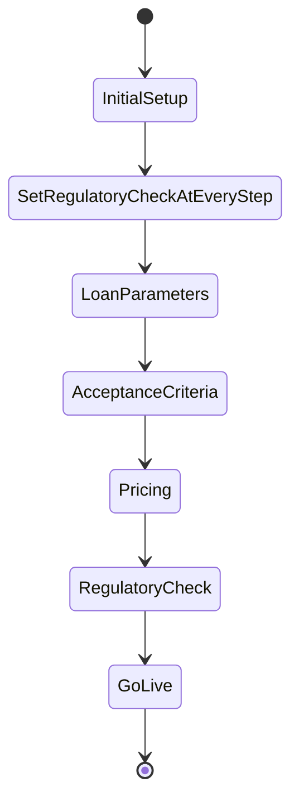

# Conversation State Machine Plan

## Overview

## 1. State Machine Store

- Add `conversationState`, `setConversationState` to `useConversationStore` (or a dedicated store).
- Preload states array:  
  `["InitialSetup", "SetRegulatoryCheckAtEveryStep", "LoanParameters", "AcceptanceCriteria", "Pricing", "RegulatoryCheck", "GoLive"]`.
- Store the current state index or value for lookup.

## 2. StateMachinePanel Component

- Place in the Settings panel alongside other controls.
- Render states as a Mermaid diagram or horizontal list, highlighting the current state.
- Provide “Previous”/“Next” buttons and allow direct click on any state node.

## 3. Developer Prompt Injection

- Extend `processMessages` in `lib/assistant.ts` to read `conversationState` before the API call.
- Prepend a placeholder instruction corresponding to the current state (to be filled in later).

## 4. User‑Driven Navigation

- Wire panel controls to call `setConversationState` on user navigation.
- Ensure the next assistant turn uses the updated state instruction.

## 5. Future LLM Suggestions

- After manual navigation works, add logic to detect when an LLM suggestion should trigger a state change.
- Prompt the user to confirm or adjust the suggested state.

## Next Steps

1. Implement store changes for state management.
2. Create `StateMachinePanel` UI component.
3. Integrate prompt injection into the assistant workflow.
4. Test manual state navigation end‑to‑end.
5. Extend for automated LLM‑driven state suggestions.
