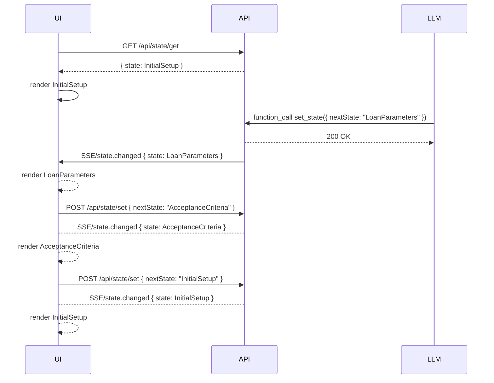
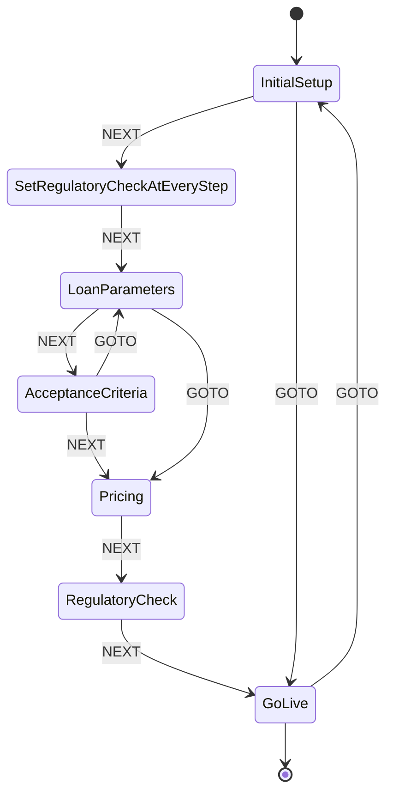

# State Machine Integration Spec

This document specifies the design and integration of a shared state machine for managing conversation flow and UI rendering in the Lending AI Studio app.

---

## 1. Overview

- **Goal**: Keep the conversation state in sync between the LLM assistant and the UI.
- **States**:
  1. InitialSetup
  2. SetRegulatoryCheckAtEveryStep
  3. LoanParameters
  4. AcceptanceCriteria
  5. Pricing
  6. RegulatoryCheck
  7. GoLive

Transitions:

- **Forward (NEXT)**: move to the immediately next state.
- **Direct (GOTO)**: jump from any state to any other state.

---

## 2. Server API Endpoints

### 2.1 GET /api/state/get

- **Response**:
  ```json
  { "state": "InitialSetup" }
  ```

### 2.2 POST /api/state/set

- **Body**:
  ```json
  { "nextState": "LoanParameters" }
  ```
- **Side Effects**:
  - Persist new state in backend store.
  - Emit a `state.changed` event via SSE or WebSocket.

---

## 3. Event Propagation

- **Server-Sent Events (SSE)** or **WebSockets** broadcast state changes.
- Client subscribes on page load and updates UI on:
  ```json
  { "event": "state.changed", "data": { "state": "LoanParameters" } }
  ```

---

## 4. LLM Integration

1. **LLM-driven transitions**:

   - The assistant calls the `set_state` function-tool via function-calling:
     ```json
     { "name": "set_state", "arguments": { "nextState": "LoanParameters" } }
     ```
   - Backend handles the function call and triggers `POST /api/state/set`.

2. **Tool calls & UI reflection**:
   - After storing or reading product details (`store_product`, `read_product`), the assistant advises the next state.
   - A `state.changed` event notifies the UI.

---

## 5. UI Integration

1. **Bootstrap**:
   - On load, call `GET /api/state/get` to determine current state.
2. **Render**:
   - Display the panel or form corresponding to the current state.
3. **User-driven transitions**:
   - UI “Next” buttons or state selectors call `POST /api/state/set`.
4. **Real-time updates**:
   - Subscribe to SSE/WebSocket to listen for `state.changed`.
5. **Direct jumps**:
   - UI allows jumping to any state via the same `POST /api/state/set` endpoint.

---

## 6. Shared State Machine Definition

Use [XState](https://xstate.js.org/) to define and validate transitions:

```js
import { createMachine } from "xstate";

export const conversationMachine = createMachine({
  id: "conversation",
  initial: "InitialSetup",
  states: {
    InitialSetup: {
      on: {
        NEXT: "SetRegulatoryCheckAtEveryStep",
        GOTO: { target: (ctx, event) => event.nextState },
      },
    },
    SetRegulatoryCheckAtEveryStep: {
      on: {
        NEXT: "LoanParameters",
        GOTO: { target: (ctx, event) => event.nextState },
      },
    },
    LoanParameters: {
      on: {
        NEXT: "AcceptanceCriteria",
        GOTO: { target: (ctx, event) => event.nextState },
      },
    },
    AcceptanceCriteria: {
      on: {
        NEXT: "Pricing",
        GOTO: { target: (ctx, event) => event.nextState },
      },
    },
    Pricing: {
      on: {
        NEXT: "RegulatoryCheck",
        GOTO: { target: (ctx, event) => event.nextState },
      },
    },
    RegulatoryCheck: {
      on: {
        NEXT: "GoLive",
        GOTO: { target: (ctx, event) => event.nextState },
      },
    },
    GoLive: {
      type: "final",
      on: {
        GOTO: { target: (ctx, event) => event.nextState },
      },
    },
  },
});
```

---

## 7. Diagrams

### 7.1 Sequence Diagram



### 7.2 Statechart Diagram



---

## 8. Next Steps

1. Decide on SSE vs. WebSocket for real-time updates.
2. Implement the `/api/state/get` and `/api/state/set` handlers.
3. Integrate the shared XState definition in both frontend and backend.
4. Update UI panels to subscribe to state and emit transitions.

---

_End of Spec_
